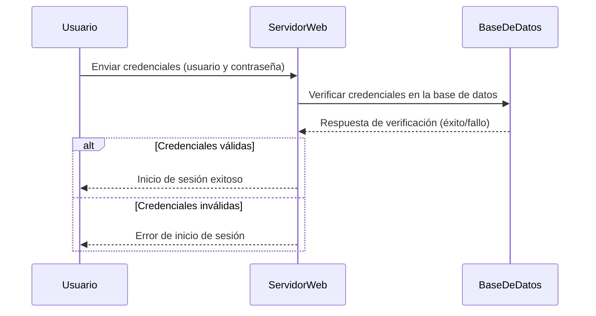

# FlaskEcommerce API Documentation

Este repositorio contiene una API de comercio electrónico desarrollada con Flask, diseñada para ser consumida por aplicaciones frontend como Angular, React, Vue, etc.

## Descripción General

FlaskEcommerce proporciona una API RESTful para una tienda online completa con:
- Gestión de productos
- Autenticación de usuarios
- Carrito de compras
- Procesamiento de pedidos

## Endpoints Disponibles

### Autenticación de Usuarios

#### Login
- **URL**: `/api/login`
- **Método**: POST
- **Datos de entrada**:
```json
{
  "email": "usuario@ejemplo.com",
  "password": "contraseña123"
}
```
- **Respuesta exitosa**:
```json
{
  "status": "success",
  "message": "Login exitoso",
  "token": "eyJhbGciOiJIUzI1NiIsInR5cCI6IkpXVCJ9...",
  "user_id": 123
}
```

#### Registro
- **URL**: `/api/register`
- **Método**: POST
- **Datos de entrada**:
```json
{
  "name": "Nombre Usuario",
  "email": "usuario@ejemplo.com",
  "password": "contraseña123"
}
```
- **Respuesta exitosa**:
```json
{
  "status": "success",
  "message": "Usuario registrado correctamente",
  "user_id": 123
}
```

### Gestión de Productos

#### Listar Productos
- **URL**: `/api/products`
- **Método**: GET
- **Respuesta**:
```json
{
  "products": [
    {
      "id": 1,
      "name": "Producto 1",
      "description": "Descripción del producto",
      "price": 99.99,
      "category_id": 2,
      "image_url": "/static/images/product1.jpg",
      "stock": 50
    },
    {
      "id": 2,
      "name": "Producto 2",
      "description": "Descripción del producto 2",
      "price": 149.99,
      "category_id": 1,
      "image_url": "/static/images/product2.jpg",
      "stock": 25
    }
  ]
}
```

#### Detalle de Producto
- **URL**: `/api/products/{id}`
- **Método**: GET
- **Respuesta**:
```json
{
  "id": 1,
  "name": "Producto 1",
  "description": "Descripción detallada del producto",
  "price": 99.99,
  "category_id": 2,
  "image_url": "/static/images/product1.jpg",
  "stock": 50,
  "specifications": [
    {"key": "Color", "value": "Negro"},
    {"key": "Tamaño", "value": "M"}
  ]
}
```

#### Productos por Categoría
- **URL**: `/api/products/category/{category_id}`
- **Método**: GET
- **Respuesta**:
```json
{
  "products": [
    {
      "id": 1,
      "name": "Producto 1",
      "description": "Descripción breve",
      "price": 99.99,
      "category_id": 2,
      "image_url": "/static/images/product1.jpg",
      "stock": 50
    }
  ],
  "category_name": "Electrónicos"
}
```

### Gestión del Carrito

#### Ver Carrito
- **URL**: `/api/cart`
- **Método**: GET
- **Headers**: Authorization: Bearer {token}
- **Respuesta**:
```json
{
  "cart_items": [
    {
      "id": 1,
      "product_id": 5,
      "product_name": "Producto 5",
      "quantity": 2,
      "price": 99.99,
      "total": 199.98,
      "image_url": "/static/images/product5.jpg"
    }
  ],
  "total": 199.98
}
```

#### Añadir Producto al Carrito
- **URL**: `/api/cart/add`
- **Método**: POST
- **Headers**: Authorization: Bearer {token}
- **Datos de entrada**:
```json
{
  "product_id": 5,
  "quantity": 2
}
```
- **Respuesta exitosa**:
```json
{
  "status": "success",
  "message": "Producto añadido al carrito",
  "cart_item": {
    "id": 1,
    "product_id": 5,
    "product_name": "Producto 5",
    "quantity": 2,
    "price": 99.99,
    "total": 199.98
  }
}
```

#### Actualizar Cantidad
- **URL**: `/api/cart/update`
- **Método**: PUT
- **Headers**: Authorization: Bearer {token}
- **Datos de entrada**:
```json
{
  "cart_item_id": 1,
  "quantity": 3
}
```
- **Respuesta exitosa**:
```json
{
  "status": "success",
  "message": "Cantidad actualizada",
  "cart_item": {
    "id": 1,
    "product_id": 5,
    "quantity": 3,
    "total": 299.97
  }
}
```

#### Eliminar Producto del Carrito
- **URL**: `/api/cart/remove/{cart_item_id}`
- **Método**: DELETE
- **Headers**: Authorization: Bearer {token}
- **Respuesta exitosa**:
```json
{
  "status": "success",
  "message": "Producto eliminado del carrito"
}
```

### Gestión de Pedidos

#### Listar Pedidos
- **URL**: `/api/orders`
- **Método**: GET
- **Headers**: Authorization: Bearer {token}
- **Respuesta**:
```json
{
  "orders": [
    {
      "id": 1,
      "date": "2023-07-15T10:30:00",
      "status": "enviado",
      "total": 399.98,
      "items_count": 3
    },
    {
      "id": 2,
      "date": "2023-07-10T15:45:00",
      "status": "entregado",
      "total": 199.99,
      "items_count": 1
    }
  ]
}
```

#### Detalle de Pedido
- **URL**: `/api/orders/{order_id}`
- **Método**: GET
- **Headers**: Authorization: Bearer {token}
- **Respuesta**:
```json
{
  "id": 1,
  "date": "2023-07-15T10:30:00",
  "status": "enviado",
  "total": 399.98,
  "shipping_address": {
    "street": "Calle Principal 123",
    "city": "Santa Cruz",
    "state": "Santa Cruz",
    "country": "Bolivia",
    "postal_code": "0000"
  },
  "items": [
    {
      "product_id": 5,
      "product_name": "Producto 5",
      "quantity": 2,
      "price": 99.99,
      "total": 199.98
    },
    {
      "product_id": 8,
      "product_name": "Producto 8",
      "quantity": 1,
      "price": 200.00,
      "total": 200.00
    }
  ]
}
```

#### Crear Pedido (Checkout)
- **URL**: `/api/checkout`
- **Método**: POST
- **Headers**: Authorization: Bearer {token}
- **Datos de entrada**:
```json
{
  "shipping_address": {
    "street": "Calle Principal 123",
    "city": "Santa Cruz",
    "state": "Santa Cruz",
    "country": "Bolivia",
    "postal_code": "0000"
  },
  "payment_method": {
    "type": "credit_card",
    "card_number": "XXXX-XXXX-XXXX-1234",
    "expiry_date": "12/25",
    "cvv": "123"
  }
}
```
- **Respuesta exitosa**:
```json
{
  "status": "success",
  "message": "Pedido creado correctamente",
  "order_id": 3,
  "total": 299.97
}
```

## Recomendaciones para integración

1. **Autenticación**: Implementar almacenamiento seguro del token JWT en el frontend
2. **Manejo de errores**: Todos los endpoints tienen esta estructura de respuesta para errores:
```json
{
  "status": "error",
  "message": "Descripción del error",
  "code": 400
}
```
3. **Validación**: Realizar validación tanto en frontend como en backend

## Tecnologías utilizadas

- **Backend**: Flask (Python)
- **ORM**: SQLAlchemy
- **Base de datos**: SQL (probablemente PostgreSQL/MySQL)
- **Autenticación**: JWT


